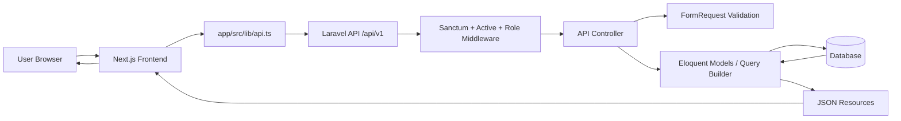
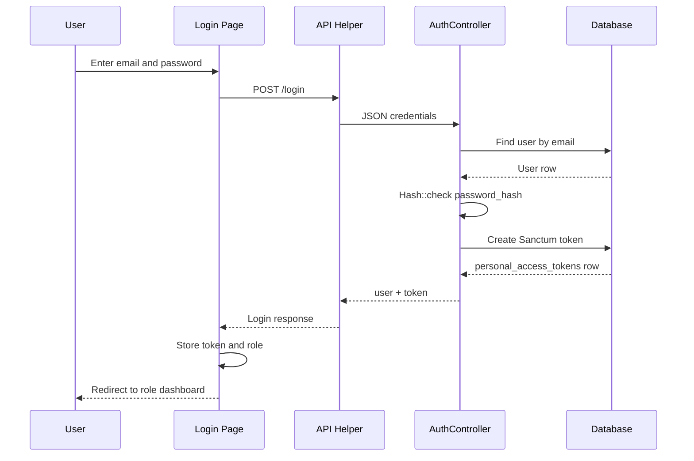
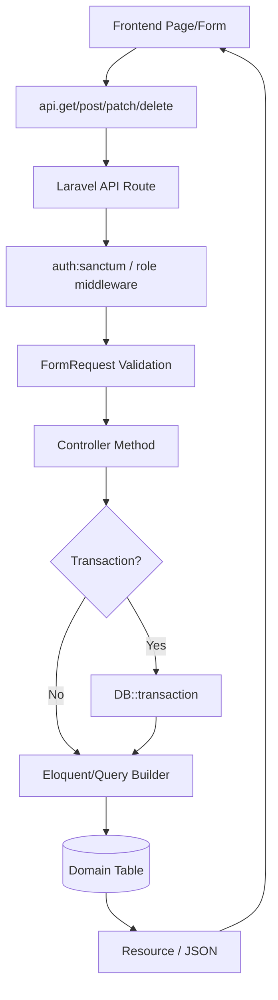
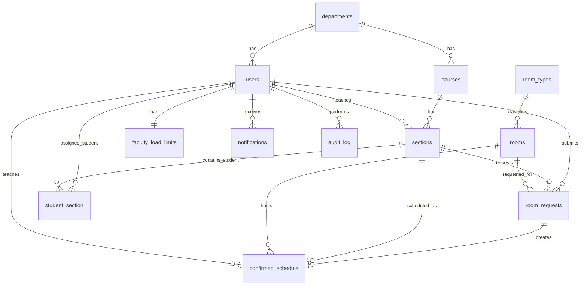

# System Documentation

## 1. Project Overview

The Automated Faculty Load and Room Scheduler is a full-stack web application for managing campus room assignments, faculty teaching load, class sections, schedules, room requests, notifications, and audit records.

The project is split into two main applications:

| Area | Path | Purpose |
|---|---|---|
| Frontend | `app/` | Next.js application used by Admin, Instructor, and Student users. |
| Backend | `backend/` | Laravel API that authenticates users, validates requests, applies role rules, and persists data. |

Main users found in the current codebase:

| User | Role value | Main capabilities |
|---|---|---|
| Admin | `Admin` | Manage users, departments, courses, sections, rooms, room requests, faculty load limits, reports, schedules, and audit logs. |
| Instructor | `Instructor` | Browse rooms, submit room requests, view own requests, cancel/release own requests, view own schedule and faculty load. |
| Student | `Student` | View own dashboard and assigned class schedule. |

Core features implemented in the current codebase:

- Login, logout, authenticated user lookup, forgot password, reset password, and change password.
- Role-protected Admin, Instructor, and Student API routes.
- User, department, course, section, room, room request, schedule, faculty load, notification, and audit log modules.
- Sanctum bearer token authentication.
- Next.js route protection through `app/src/proxy.ts` using `token` and `role` cookies.
- Database migrations for the main domain tables.
- Eloquent models and relationships for the main tables.
- Reporting views for master schedule and faculty load summary.
- Stored procedure calls for room request submission and approval.

Not found in the current codebase:

- A public self-registration flow.
- Migration or model for the `buildings` table queried by `/admin/buildings`.
- Stored procedure definitions for `sp_submit_room_request` and `sp_approve_request`.
- Email sending logic for forgot-password reset links.

## 2. Full System Flow

### High-Level Flow

1. A user opens the Next.js frontend in `app/src/app`.
2. The login page submits credentials through `app/src/lib/api.ts` to the Laravel API.
3. Laravel validates credentials in `backend/app/Http/Controllers/API/AuthController.php`.
4. If login succeeds, Laravel returns a Sanctum bearer token and user resource.
5. The frontend stores the token in browser storage and cookies.
6. Protected frontend routes are guarded by `app/src/proxy.ts`.
7. Frontend pages call backend API endpoints through the shared `api` helper.
8. Backend routes in `backend/routes/api.php` apply `auth:sanctum`, `active`, and role middleware.
9. Controllers validate input through FormRequest classes, use Eloquent models/query builder/stored procedures, and return JSON envelopes.
10. Frontend pages render data, loading states, error states, and forms based on API responses.

### Request and Response Contract

Most backend responses use this envelope:

```json
{
  "success": true,
  "message": "Human-readable message.",
  "data": {},
  "meta": {}
}
```

Errors generally use:

```json
{
  "success": false,
  "message": "Human-readable error.",
  "errors": {},
  "data": null
}
```

The frontend API helper is in `app/src/lib/api.ts`. It:

- Reads `NEXT_PUBLIC_API_BASE_URL` or `NEXT_PUBLIC_API_URL`.
- Appends the requested path.
- Sends `Content-Type: application/json` and `Accept: application/json`.
- Adds `Authorization: Bearer <token>` when a token exists in `sessionStorage` or `localStorage`.
- Throws an `Error` for non-2xx responses.

### Frontend to Backend to Database Flow

| Step | Component/File | Responsibility |
|---|---|---|
| User action | `app/src/app/**/page.tsx` | User clicks, submits forms, filters tables, or navigates. |
| API call | `app/src/lib/api.ts` | Builds HTTP request and attaches bearer token. |
| API route | `backend/routes/api.php` | Maps method/path to controller and middleware. |
| Middleware | `auth:sanctum`, `active`, `role:*` | Authenticates token, blocks inactive users, enforces role. |
| Validation | `backend/app/Http/Requests/*.php` | Validates submitted request body. |
| Controller | `backend/app/Http/Controllers/API/**/*.php` | Runs application logic and coordinates persistence. |
| Persistence | `backend/app/Models/*.php`, `DB::table`, `DB::select` | Reads/writes MySQL tables, views, and stored procedures. |
| Resource | `backend/app/Http/Resources/*.php` | Shapes returned JSON. |
| UI update | Frontend page state | Updates page data, messages, errors, tables, and cards. |

## 3. Backend Flow

The backend is a Laravel 13 API configured in `backend/bootstrap/app.php`. API routes are automatically prefixed with `/api/v1`.

### Route Groups

Public routes:

| Method | API path | Controller |
|---|---|---|
| POST | `/api/v1/login` | `AuthController@login` |
| POST | `/api/v1/forgot-password` | `AuthController@forgotPassword` |
| POST | `/api/v1/reset-password/{token}` | `AuthController@resetPassword` |

Authenticated routes use:

- `auth:sanctum`
- `active`

Role routes use:

- `role:admin`
- `role:instructor`
- `role:student`

### Example: Login Flow

1. Frontend login form in `app/src/app/page.tsx` posts email/password to `/login`.
2. `LoginRequest` validates:
   - `email`: required, email, max 100
   - `password`: required string
3. `AuthController@login` finds the user by email.
4. Password is verified with `Hash::check($request->password, $user->password_hash)`.
5. Inactive users are rejected with HTTP 403.
6. Laravel Sanctum creates a token with `$user->createToken('api-token')->plainTextToken`.
7. Response contains `data.user` and `data.token`.
8. Frontend stores token in browser storage/cookie and redirects based on role.

### Validation Flow

Write endpoints generally use FormRequest classes in `backend/app/Http/Requests`.

Examples:

| Request class | Used for | Important validation |
|---|---|---|
| `LoginRequest` | Login | Email and password required. |
| `UserRequest` | Admin user create/update | Unique email, role enum, password min length, department exists. |
| `RoomRequest` | Admin room create/update | Unique room number, capacity min 1, room type exists. |
| `SectionRequest` | Admin section create/update | Instructor must exist with `Instructor` role, time end after start. |
| `SubmitRoomRequest` | Instructor room request submission | Section must belong to current instructor, room must be available. |
| `RequestReviewRequest` | Approve/reject/cancel/release remarks | Nullable string remarks. |
| `FacultyLoadRequest` | Faculty load limit | Instructor must exist with `Instructor` role. |

### Error Handling

Controllers return explicit JSON errors for common failures:

- `401` for invalid credentials.
- `403` for deactivated accounts or forbidden roles.
- `404` for missing records.
- `422` for validation/domain failures.
- `500` for caught unexpected errors.

Laravel validation failures are handled by Laravel's validation system. Many controllers catch `Throwable` and return a generic failure message.

## 4. Authentication and Password Handling

### Login

Files:

- `app/src/app/page.tsx`
- `app/src/lib/api.ts`
- `app/src/lib/auth.ts`
- `backend/routes/api.php`
- `backend/app/Http/Controllers/API/AuthController.php`
- `backend/app/Http/Requests/LoginRequest.php`
- `backend/app/Models/User.php`

Backend login verifies `users.email` and `users.password_hash`. Tokens are created with Laravel Sanctum and stored in `personal_access_tokens`.

### Registration

Public registration is not found in the current codebase.

Admin-controlled user creation exists:

- Frontend: `app/src/app/admin/users/create/page.tsx`
- API: `POST /api/v1/admin/users`
- Controller: `backend/app/Http/Controllers/API/Admin/UserController.php`
- Request: `backend/app/Http/Requests/UserRequest.php`
- Table: `users`

### Password Hashing and Verification

Password hashing uses Laravel's `Hash` facade:

| Operation | File | Method |
|---|---|---|
| Admin creates user password | `backend/app/Http/Controllers/API/Admin/UserController.php` | `Hash::make($request->password)` |
| Admin updates user password | `backend/app/Http/Controllers/API/Admin/UserController.php` | `Hash::make($request->password)` |
| Admin resets password | `backend/app/Http/Controllers/API/Admin/UserController.php` | `Hash::make($validated['password'])` |
| Login verification | `backend/app/Http/Controllers/API/AuthController.php` | `Hash::check(...)` |
| User changes password | `backend/app/Http/Controllers/API/AuthController.php` | `Hash::check(...)`, then `Hash::make(...)` |
| Reset token storage | `backend/app/Http/Controllers/API/AuthController.php` | `Hash::make($token)` |
| Reset token verification | `backend/app/Http/Controllers/API/AuthController.php` | `Hash::check($request->token, $record->token)` |

The database column is named `password_hash`, not Laravel's default `password`.

### Token, Cookie, and Session Usage

Backend:

- Uses Sanctum bearer tokens through `auth:sanctum`.
- Token records are stored in `personal_access_tokens`.
- `AuthController@logout` deletes the current access token.
- Admin deactivation and admin password reset delete all tokens for the target user.

Frontend:

- `app/src/lib/api.ts` reads token from `sessionStorage` first, then `localStorage`.
- `app/src/lib/auth.ts` stores token in `localStorage` and also writes `token` and `role` cookies.
- `app/src/app/page.tsx` supports remembered and non-remembered token storage.
- `app/src/proxy.ts` checks cookies for route protection.

### Protected Routes

Backend protected routes are all inside the `auth:sanctum` and `active` group in `backend/routes/api.php`.

Frontend protected routes are matched in `app/src/proxy.ts`:

- `/admin/:path*`
- `/instructor/:path*`
- `/student/:path*`
- `/requests/:path*`
- `/notifications`
- `/profile`
- `/change-password`
- `/forgot-password`
- `/reset-password/:path*`

Note: `/forgot-password` and `/reset-password/:path*` are also treated as public inside proxy logic.

### Role-Based Access

Backend role middleware:

- File: `backend/app/Http/Middleware/RoleMiddleware.php`
- Compares lowercase versions of the authenticated user's role and route role argument.
- Allows route definitions like `role:admin` even though database values are `Admin`, `Instructor`, and `Student`.

Policies exist for:

- Departments
- Rooms
- Room requests
- Sections
- Notifications

Several controllers perform direct ownership checks instead of calling policies. Example: instructor request reads are filtered by `instructor_id = Auth::id()`.

## 5. Data Flow Across the Codebase

### Data Creation

| Data | Created by | Files |
|---|---|---|
| Users | Admin user create | `Admin/UserController.php`, `UserRequest.php`, `users` table |
| Departments | Admin department create | `Admin/DepartmentController.php`, `DepartmentRequest.php`, `departments` table |
| Courses | Admin course create | `Admin/CourseController.php`, `CourseRequest.php`, `courses` table |
| Sections | Admin section create | `Admin/SectionController.php`, `SectionRequest.php`, `sections` table |
| Student-section assignments | Admin assignment | `Admin/SectionStudentController.php`, `AssignStudentRequest.php`, `student_section` table |
| Rooms | Admin room create | `Admin/RoomController.php`, `RoomRequest.php`, `rooms` table |
| Room requests | Instructor submit | `Instructor/RequestController.php`, `SubmitRoomRequest.php`, stored procedure `sp_submit_room_request` |
| Confirmed schedules | Request approval | Stored procedure `sp_approve_request` is called; procedure definition not found. |
| Faculty load limits | Admin create/update | `Admin/FacultyLoadController.php`, `FacultyLoadRequest.php`, `faculty_load_limits` table |
| Notifications | Services/workflows | `NotificationService.php`, `notifications` table |
| Audit logs | Services/workflows | `AuditService.php`, `audit_log` table |

### Data Validation

Validation happens mostly in `backend/app/Http/Requests`. Some simple filters use raw `Request` objects in controllers. Frontend forms also perform basic UI checks in page components, but backend validation is authoritative.

### Data Storage

Data is stored in MySQL-oriented tables created by migrations in `backend/database/migrations`. Eloquent models in `backend/app/Models` map to those tables.

### Data Fetching

Data is fetched through:

- Eloquent queries such as `User::with('department')->paginate(15)`.
- Relationship queries such as `$request->user()->notifications()`.
- Query builder calls such as `DB::table('vw_master_schedule')->paginate(15)`.
- Stored procedure calls through `DB::select(...)`.

### Data Updates

Updates happen through Eloquent `update`, `updateOrCreate`, query builder `update`, and stored procedures.

Examples:

- Profile updates: `ProfileController@update`
- Room availability toggle: `Admin/RoomController@toggleAvailability`
- User deactivation/reactivation: `Admin/UserController`
- Notification read status: `NotificationController`
- Room request reject/cancel/release: Admin and Instructor request controllers
- Schedule release: `Admin/ScheduleController@release`

### Data Deletion

Hard delete endpoints found:

- Departments: `DELETE /api/v1/admin/departments/{id}`
- Sections: `DELETE /api/v1/admin/sections/{id}`
- Student assignment: `DELETE /api/v1/admin/sections/{id}/students/{student_id}`
- Rooms: `DELETE /api/v1/admin/rooms/{id}`

Token deletion:

- Logout deletes current token.
- User deactivation and admin password reset delete all target-user tokens.
- Password reset deletes the reset token row.

Soft/status changes:

- Users use `is_active`.
- Schedules use `is_active`.
- Room requests use status values.

## 6. CRUD Implementation

### Users

| Action | Frontend | API | Backend | Table |
|---|---|---|---|---|
| Create | `app/src/app/admin/users/create/page.tsx` | `POST /admin/users` | `Admin/UserController@store` | `users` |
| Read list | `app/src/app/admin/users/page.tsx` | `GET /admin/users` | `Admin/UserController@index` | `users`, `departments` |
| Read detail | `app/src/app/admin/users/[id]/page.tsx` | `GET /admin/users/{id}` | `Admin/UserController@show` | `users`, `departments` |
| Update | `app/src/app/admin/users/[id]/page.tsx` | `PATCH /admin/users/{id}` | `Admin/UserController@update` | `users` |
| Deactivate | Admin user pages | `POST /admin/users/{id}/deactivate` | `Admin/UserController@deactivate` | `users`, `personal_access_tokens` |
| Reactivate | Admin user pages | `POST /admin/users/{id}/reactivate` | `Admin/UserController@reactivate` | `users` |
| Delete | Not found in the current codebase. | Not found | Not found | Not found |

### Departments

| Action | API | Backend | Table |
|---|---|---|---|
| Create | `POST /admin/departments` | `Admin/DepartmentController@store` | `departments` |
| Read | `GET /admin/departments` | `Admin/DepartmentController@index` | `departments` |
| Update | `PATCH /admin/departments/{id}` | `Admin/DepartmentController@update` | `departments` |
| Delete | `DELETE /admin/departments/{id}` | `Admin/DepartmentController@destroy` | `departments` |

Dedicated frontend department management pages are not found in the current codebase. Department data is consumed by user forms.

### Courses

| Action | API | Backend | Table |
|---|---|---|---|
| Create | `POST /admin/courses` | `Admin/CourseController@store` | `courses` |
| Read | `GET /admin/courses` | `Admin/CourseController@index` | `courses`, `departments` |
| Update | Not found in the current codebase. | Not found | Not found |
| Delete | Not found in the current codebase. | Not found | Not found |

Dedicated frontend course management pages are not found in the current codebase.

### Sections and Student Assignments

| Action | API | Backend | Table |
|---|---|---|---|
| Create section | `POST /admin/sections` | `Admin/SectionController@store` | `sections` |
| Read sections | `GET /admin/sections` | `Admin/SectionController@index` | `sections`, `courses`, `users` |
| Read section | `GET /admin/sections/{id}` | `Admin/SectionController@show` | `sections` |
| Update section | `PATCH /admin/sections/{id}` | `Admin/SectionController@update` | `sections` |
| Delete section | `DELETE /admin/sections/{id}` | `Admin/SectionController@destroy` | `sections` |
| Assign student | `POST /admin/sections/{id}/students` | `Admin/SectionStudentController@store` | `student_section` |
| Read assigned students | `GET /admin/sections/{id}/students` | `Admin/SectionStudentController@index` | `student_section`, `users` |
| Remove student | `DELETE /admin/sections/{id}/students/{student_id}` | `Admin/SectionStudentController@destroy` | `student_section` |

Dedicated frontend section pages are not found in the current codebase.

### Rooms and Room Types

| Action | Frontend | API | Backend | Table |
|---|---|---|---|---|
| Create room | `app/src/app/admin/rooms/create/page.tsx` | `POST /admin/rooms` | `Admin/RoomController@store` | `rooms` |
| Read rooms | `app/src/app/admin/rooms/page.tsx` | `GET /admin/rooms` | `Admin/RoomController@index` | `rooms`, `room_types` |
| Read room | `app/src/app/admin/rooms/[id]/page.tsx` | `GET /admin/rooms/{id}` | `Admin/RoomController@show` | `rooms`, `room_types` |
| Update room | `app/src/app/admin/rooms/[id]/page.tsx` | `PATCH /admin/rooms/{id}` | `Admin/RoomController@update` | `rooms` |
| Toggle availability | Admin room pages | `PATCH /admin/rooms/{id}/toggle` | `Admin/RoomController@toggleAvailability` | `rooms` |
| Delete room | `app/src/app/admin/rooms/[id]/page.tsx` | `DELETE /admin/rooms/{id}` | `Admin/RoomController@destroy` | `rooms` |
| Read room types | Admin room pages | `GET /admin/room-types` | `Admin/RoomController@types` | `room_types` |
| Browse rooms | `app/src/app/instructor/rooms/page.tsx` | `GET /instructor/rooms` | `Instructor/RoomController@index` | `rooms`, `room_types`, `room_requests` |

### Room Requests

| Action | Frontend | API | Backend | Table/Procedure |
|---|---|---|---|---|
| Instructor create | `app/src/app/requests/create/page.tsx` | `POST /requests` | `Instructor/RequestController@store` | `sp_submit_room_request` |
| Instructor list | `app/src/app/requests/page.tsx` | `GET /requests` | `Instructor/RequestController@index` | `room_requests` |
| Instructor detail | `app/src/app/requests/[id]/page.tsx` | `GET /requests/{id}` | `Instructor/RequestController@show` | `room_requests` |
| Instructor cancel | Request pages | `POST /requests/{id}/cancel` | `Instructor/RequestController@cancel` | `room_requests`, `notifications`, `audit_log` |
| Instructor release | Request pages | `POST /requests/{id}/release` | `Instructor/RequestController@release` | `room_requests`, `confirmed_schedule`, `notifications`, `audit_log` |
| Admin list | `app/src/app/admin/requests/page.tsx` | `GET /admin/requests` | `Admin/RoomRequestController@index` | `room_requests` |
| Admin detail | `app/src/app/admin/requests/[id]/page.tsx` | `GET /admin/requests/{id}` | `Admin/RoomRequestController@show` | `room_requests` |
| Admin approve | Admin request pages | `POST /admin/requests/{id}/approve` | `Admin/RoomRequestController@approve` | `sp_approve_request` |
| Admin reject | Admin request pages | `POST /admin/requests/{id}/reject` | `Admin/RoomRequestController@reject` | `room_requests`, `notifications`, `audit_log` |
| Delete | Not found in the current codebase. | Not found | Not found | Not found |

### Confirmed Schedule

| Action | Frontend | API | Backend | Table/View |
|---|---|---|---|---|
| Admin read | `app/src/app/admin/schedule/page.tsx` | `GET /admin/schedule` | `Admin/ScheduleController@index` | `vw_master_schedule` |
| Admin release | `app/src/app/admin/schedule/page.tsx` | `POST /admin/schedule/{id}/release` | `Admin/ScheduleController@release` | `confirmed_schedule` |
| Instructor read | `app/src/app/instructor/schedule/page.tsx` | `GET /instructor/schedule` | `Instructor/ScheduleController@index` | `confirmed_schedule` |
| Student read | `app/src/app/student/schedule/page.tsx` | `GET /student/schedule` | `Student/ScheduleController@index` | `confirmed_schedule`, `student_section` |
| Create/update/delete direct endpoints | Not found in the current codebase. | Not found | Not found | Not found |

### Faculty Load

| Action | Frontend | API | Backend | Table/View |
|---|---|---|---|---|
| Admin list | `app/src/app/admin/faculty-load/page.tsx` | `GET /admin/faculty-load` | `Admin/FacultyLoadController@index` | `vw_faculty_load_summary` |
| Admin detail | `app/src/app/admin/faculty-load/[id]/page.tsx` | `GET /admin/faculty-load/{id}` | `Admin/FacultyLoadController@show` | `vw_faculty_load_summary` |
| Admin set limit | Admin faculty-load pages | `POST /admin/faculty-load` | `Admin/FacultyLoadController@store` | `faculty_load_limits` |
| Admin update limit | `app/src/app/admin/faculty-load/[id]/page.tsx` | `PATCH /admin/faculty-load/{id}` | `Admin/FacultyLoadController@update` | `faculty_load_limits` |
| Instructor read | `app/src/app/instructor/faculty-load/page.tsx` | `GET /instructor/faculty-load` | `Instructor/FacultyLoadController@index` | `vw_faculty_load_summary` |
| Delete | Not found in the current codebase. | Not found | Not found | Not found |

### Notifications

| Action | Frontend | API | Backend | Table |
|---|---|---|---|---|
| Read list | `app/src/app/notifications/page.tsx` | `GET /notifications` | `NotificationController@index` | `notifications` |
| Mark one read | `app/src/app/notifications/page.tsx` | `PATCH /notifications/{id}/read` | `NotificationController@markRead` | `notifications` |
| Mark all read | `app/src/app/notifications/page.tsx` | `PATCH /notifications/read-all` | `NotificationController@markAllRead` | `notifications` |
| Create | Internal service | Not direct API | `NotificationService@notify` | `notifications` |
| Delete | Not found in the current codebase. | Not found | Not found | Not found |

### Audit Logs

| Action | Frontend | API | Backend | Table |
|---|---|---|---|---|
| Read/filter | `app/src/app/admin/audit-log/page.tsx` | `GET /admin/audit-log` | `Admin/AuditLogController@index` | `audit_log` |
| Create | Internal service | Not direct API | `AuditService@log` | `audit_log` |
| Update/delete | Not found in the current codebase. | Not found | Not found | Not found |

## 7. Database Schema Design

### Tables

#### `departments`

Purpose: Stores academic departments.

| Column | Type | Key/constraint |
|---|---|---|
| `id` | bigint unsigned | Primary key |
| `name` | string(100) | Unique |
| `code` | string(10) | Unique |
| `created_at` | timestamp | Laravel timestamp |
| `updated_at` | timestamp | Laravel timestamp |

Relationships:

- One department has many users.
- One department has many courses.

#### `users`

Purpose: Central account table for Admin, Instructor, and Student users.

| Column | Type | Key/constraint |
|---|---|---|
| `id` | bigint unsigned | Primary key |
| `employee_id` | string(20), nullable | Unique |
| `student_id` | string(20), nullable | Unique |
| `email` | string(100) | Unique |
| `password_hash` | text | Hashed password |
| `first_name` | string(50) | Required |
| `last_name` | string(50) | Required |
| `dept_id` | foreign id | References `departments.id` |
| `role` | enum | `Admin`, `Instructor`, `Student` |
| `is_irregular` | boolean | Default false |
| `is_active` | boolean | Default true |
| `created_at` | timestamp | Laravel timestamp |
| `updated_at` | timestamp | Laravel timestamp |

Relationships:

- User belongs to department.
- Instructor has one faculty load limit.
- Instructor has many sections.
- Instructor has many room requests.
- Student has many student-section assignments.
- User has many notifications.

#### `room_types`

Purpose: Classifies rooms.

| Column | Type | Key/constraint |
|---|---|---|
| `id` | bigint unsigned | Primary key |
| `name` | string(50) | Unique |
| `created_at` | timestamp | Laravel timestamp |
| `updated_at` | timestamp | Laravel timestamp |

Relationships:

- One room type has many rooms.

#### `rooms`

Purpose: Stores schedulable rooms.

| Column | Type | Key/constraint |
|---|---|---|
| `id` | bigint unsigned | Primary key |
| `room_number` | string(20) | Unique |
| `building` | string(100) | Required |
| `capacity` | integer | Required |
| `type_id` | foreign id | References `room_types.id` |
| `is_available` | boolean | Default true |
| `created_at` | timestamp | Laravel timestamp |
| `updated_at` | timestamp | Laravel timestamp |

Relationships:

- Room belongs to room type.
- Room has many room requests.
- Room has many confirmed schedules.

#### `faculty_load_limits`

Purpose: Stores maximum units/classes per instructor.

| Column | Type | Key/constraint |
|---|---|---|
| `id` | bigint unsigned | Primary key |
| `instructor_id` | foreign id | Unique, references `users.id` |
| `max_units` | decimal(4,1) | Required |
| `max_classes` | integer | Required |
| `updated_by` | foreign id | References `users.id` |
| `updated_at` | timestamp | Uses current timestamp and updates on change |

Relationships:

- Faculty load limit belongs to instructor user.
- Faculty load limit belongs to admin user through `updated_by`.

#### `courses`

Purpose: Stores academic course catalog entries.

| Column | Type | Key/constraint |
|---|---|---|
| `id` | bigint unsigned | Primary key |
| `course_code` | string(20) | Unique |
| `course_title` | string(150) | Required |
| `units` | decimal(3,1) | Required |
| `dept_id` | foreign id | References `departments.id` |
| `created_at` | timestamp | Laravel timestamp |
| `updated_at` | timestamp | Laravel timestamp |

Relationships:

- Course belongs to department.
- Course has many sections.

#### `sections`

Purpose: Stores class sections offered in a semester.

| Column | Type | Key/constraint |
|---|---|---|
| `id` | bigint unsigned | Primary key |
| `course_id` | foreign id | References `courses.id` |
| `instructor_id` | foreign id | References `users.id` |
| `section_name` | string(20) | Required |
| `semester` | string(20) | Required |
| `year_level` | integer | Required |
| `expected_students` | integer | Required |
| `day_of_week` | enum | Monday through Saturday |
| `time_start` | time | Required |
| `time_end` | time | Required |
| `status` | enum | `Draft`, `Pending`, `Confirmed`, `Cancelled`; default `Draft` |
| `created_at` | timestamp | Uses current timestamp |

Relationships:

- Section belongs to course.
- Section belongs to instructor user.
- Section has many student-section records.
- Section has many room requests.
- Section has one confirmed schedule.

#### `student_section`

Purpose: Links students to sections.

| Column | Type | Key/constraint |
|---|---|---|
| `id` | bigint unsigned | Primary key |
| `student_id` | foreign id | References `users.id` |
| `section_id` | foreign id | References `sections.id` |
| `assigned_by` | foreign id | References `users.id` |
| `assigned_at` | timestamp | Uses current timestamp |
| `student_id`, `section_id` | composite unique | Prevents duplicate assignment |

Relationships:

- Assignment belongs to student user.
- Assignment belongs to section.
- Assignment belongs to assigning admin user.

#### `room_requests`

Purpose: Stores instructor room booking requests.

| Column | Type | Key/constraint |
|---|---|---|
| `id` | bigint unsigned | Primary key |
| `section_id` | foreign id | References `sections.id` |
| `room_id` | foreign id | References `rooms.id` |
| `instructor_id` | foreign id | References `users.id` |
| `day_of_week` | enum | Monday through Saturday |
| `time_start` | time | Required |
| `time_end` | time | Required |
| `status` | enum | `Pending`, `Approved`, `Rejected`, `Cancelled`, `Released`; default `Pending` |
| `admin_remarks` | text, nullable | Review/cancel/release remarks |
| `submitted_at` | timestamp | Uses current timestamp |
| `reviewed_at` | timestamp, nullable | Review timestamp |
| `reviewed_by` | foreign id, nullable | References `users.id` |

Relationships:

- Room request belongs to section.
- Room request belongs to room.
- Room request belongs to instructor user.
- Room request belongs to reviewer user.
- Room request has one confirmed schedule.

#### `confirmed_schedule`

Purpose: Stores approved/live schedule slots.

| Column | Type | Key/constraint |
|---|---|---|
| `id` | bigint unsigned | Primary key |
| `request_id` | foreign id | Unique, references `room_requests.id` |
| `section_id` | foreign id | References `sections.id` |
| `room_id` | foreign id | References `rooms.id` |
| `instructor_id` | foreign id | References `users.id` |
| `day_of_week` | enum | Monday through Saturday |
| `time_start` | time | Required |
| `time_end` | time | Required |
| `is_active` | boolean | Default true |
| `confirmed_at` | timestamp | Uses current timestamp |

Relationships:

- Confirmed schedule belongs to room request.
- Confirmed schedule belongs to section.
- Confirmed schedule belongs to room.
- Confirmed schedule belongs to instructor user.

#### `audit_log`

Purpose: Stores significant system actions.

| Column | Type | Key/constraint |
|---|---|---|
| `id` | bigint unsigned | Primary key |
| `actor_id` | foreign id | References `users.id` |
| `action` | string(100) | Required |
| `target_table` | string(50) | Required |
| `target_id` | integer | Required |
| `details` | text | Required |
| `performed_at` | timestamp | Uses current timestamp |

Relationships:

- Audit log belongs to actor user.

#### `notifications`

Purpose: Stores user notifications.

| Column | Type | Key/constraint |
|---|---|---|
| `id` | bigint unsigned | Primary key |
| `user_id` | foreign id | References `users.id` |
| `type` | enum | See below |
| `reference_table` | string(50) | For deep linking |
| `reference_id` | integer | For deep linking |
| `message` | text | Required |
| `is_read` | boolean | Default false |
| `created_at` | timestamp | Uses current timestamp |

Allowed migration enum values:

- `Request_Submitted`
- `Request_Approved`
- `Request_Rejected`
- `Request_Cancelled`
- `Booking_Released`
- `Load_Limit_Updated`
- `Room_Status_Changed`

Issue found: `Instructor/RequestController@release` creates notification type `Request_Released`, which is not in the migration enum.

#### `password_reset_tokens`

Purpose: Stores password reset token hashes.

| Column | Type | Key/constraint |
|---|---|---|
| `email` | string | Primary key |
| `token` | string | Hashed reset token |
| `created_at` | timestamp, nullable | Creation time |

#### `personal_access_tokens`

Purpose: Laravel Sanctum bearer token storage.

| Column | Type | Key/constraint |
|---|---|---|
| `id` | bigint unsigned | Primary key |
| `tokenable_type` | string | Morph type |
| `tokenable_id` | bigint unsigned | Morph id |
| `name` | text | Token name |
| `token` | string(64) | Unique |
| `abilities` | text, nullable | Token abilities |
| `last_used_at` | timestamp, nullable | Last use |
| `expires_at` | timestamp, nullable | Indexed |
| `created_at` | timestamp | Laravel timestamp |
| `updated_at` | timestamp | Laravel timestamp |

### Views

#### `vw_master_schedule`

Defined in `backend/database/migrations/2026_05_24_000003_create_reporting_views.php`.

Purpose: Denormalized schedule report joining confirmed schedule, rooms, room types, sections, courses, and instructors.

Uses:

- `Admin/ScheduleController@index`
- `Admin/ReportController@index`
- `Admin/ReportController@masterSchedule`

#### `vw_faculty_load_summary`

Defined in `backend/database/migrations/2026_05_24_000003_create_reporting_views.php`.

Purpose: Aggregates instructor faculty load using confirmed schedules, sections, courses, departments, and load limits.

Uses:

- `Admin/FacultyLoadController@index`
- `Admin/FacultyLoadController@show`
- `Admin/ReportController@index`
- `Admin/ReportController@facultyLoad`
- `Instructor/DashboardController@index`
- `Instructor/FacultyLoadController@index`

## 8. Database Normalization

The database mostly follows normalized relational design.

How duplicate data is reduced:

- Department data is separated into `departments` and referenced by `users` and `courses`.
- Room classifications are separated into `room_types` and referenced by `rooms`.
- Course catalog data is separated into `courses`; sections reference courses.
- Student enrollment/assignment is separated into `student_section`, which avoids storing student lists inside `sections`.
- Confirmed schedules reference requests, sections, rooms, and instructors instead of duplicating full descriptive data.
- Notifications and audit logs store event records separately from the affected domain tables.

Relationship types:

| Relationship | Type |
|---|---|
| Department to users | 1-to-many |
| Department to courses | 1-to-many |
| Room type to rooms | 1-to-many |
| Course to sections | 1-to-many |
| Instructor user to sections | 1-to-many |
| Instructor user to room requests | 1-to-many |
| Instructor user to faculty load limit | 1-to-1 |
| Room request to confirmed schedule | 1-to-1 |
| Student users to sections through `student_section` | many-to-many |
| User to notifications | 1-to-many |
| User to audit logs as actor | 1-to-many |

Normalization issues or improvements:

| Issue | Location | Recommendation |
|---|---|---|
| `building` is stored as text in `rooms`, but `/admin/buildings` queries a `buildings` table that has no migration. | `rooms` migration, `Admin/RoomController@buildings` | Either add a `buildings` migration/model and FK, or remove the endpoint and use distinct `rooms.building` values. |
| Some models disable timestamps while migrations create timestamp columns. | `Department`, `RoomType` models vs migrations | Align models with migrations or remove unused timestamps. |
| `confirmed_schedule` duplicates section, room, instructor, day, and time from `room_requests`. | `confirmed_schedule` table | This is useful as a historical snapshot, but keep it synchronized through transactions/procedures. |
| Notification enum mismatch. | `notifications` migration vs `Instructor/RequestController@release` | Use `Booking_Released` or update the enum. |

## 9. SQL Usage

### COUNT

| File | Usage | Data returned |
|---|---|---|
| `Admin/DashboardController.php` | Counts users, active users, pending requests, approved requests, active confirmed bookings, unread notifications. | Admin dashboard totals. |
| `Instructor/DashboardController.php` | Counts current instructor pending requests, approved requests, and active confirmed schedules. | Instructor dashboard totals. |
| `ConflictCheckerService.php` | `COUNT(confirmed_schedule.id)` inside `selectRaw`. | Current class count for faculty load limit check. |
| `2026_05_24_000003_create_reporting_views.php` | `COUNT(cs.id)` in `vw_faculty_load_summary`. | Current classes and remaining classes per instructor. |

### SUM

| File | Usage | Data returned |
|---|---|---|
| `ConflictCheckerService.php` | `SUM(courses.units)` through joined confirmed schedules, sections, and courses. | Current instructor units. |
| `2026_05_24_000003_create_reporting_views.php` | `SUM(c.units)` in `vw_faculty_load_summary`. | Current units and utilization percentage. |

### JOIN

| File | Usage | Data returned |
|---|---|---|
| `ConflictCheckerService.php` | Joins `confirmed_schedule` to `sections` and `courses`. | Current faculty load calculation. |
| `2026_05_24_000003_create_reporting_views.php` | Joins schedule, rooms, room types, sections, courses, users, departments, and faculty load limits. | Reporting views. |
| Eloquent `with(...)` calls | Translates to related queries for departments, courses, rooms, sections, instructors. | API resources with related data. |

### GROUP BY

| File | Usage | Data returned |
|---|---|---|
| `2026_05_24_000003_create_reporting_views.php` | Groups faculty load rows by instructor and load limit fields. | One faculty load summary row per instructor. |

### ORDER BY

| File | Usage | Data returned |
|---|---|---|
| `NotificationController.php` | `orderByDesc('created_at')` | Newest notifications first. |
| `Admin/AuditLogController.php` | `orderByDesc('performed_at')` | Newest audit records first. |
| `Admin/RoomController.php` | `orderBy('name')` on `buildings` table | Building list sorted by name. |

### Filters and Search Queries

| File | Filters | Purpose |
|---|---|---|
| `Admin/AuditLogController.php` | `actor_id`, `action`, `target_table`, `from_date`, `to_date` | Filter audit logs. |
| `Admin/RoomRequestController.php` | `status` | Filter admin room request list. |
| `Instructor/RoomController.php` | `available_only`, `type_id`, `day`, `time_start`, `time_end` | Filter rooms and exclude conflicting requested/approved slots. |
| `Instructor/RequestController.php` | Instructor id from authenticated user | Only returns current instructor requests. |
| `Student/ScheduleController.php` | `whereHas` student section assignment | Only returns current student's schedule. |

### Raw SQL and Query Builder

| File | SQL usage | Purpose |
|---|---|---|
| `Instructor/RequestController.php` | `DB::select('CALL sp_submit_room_request(?, ?, ?, ?, ?, ?)')` | Submit room request through stored procedure. |
| `Admin/RoomRequestController.php` | `DB::select('CALL sp_approve_request(?, ?, ?)')` | Approve request through stored procedure. |
| `2026_05_24_000003_create_reporting_views.php` | `DB::statement(...)` | Creates reporting views. |
| `Admin/FacultyLoadController.php` | `DB::table('vw_faculty_load_summary')` | Reads faculty load view. |
| `Admin/ScheduleController.php` | `DB::table('vw_master_schedule')` | Reads schedule view. |
| `Admin/ReportController.php` | `DB::table(...)` | Reads report views. |
| `AuthController.php` | `DB::table('password_reset_tokens')` | Stores, reads, and deletes reset token records. |
| `Admin/DashboardController.php` | `DB::table(...)->count()` | Dashboard counters. |

Stored procedure definitions are not found in the current codebase.

## 10. Security Implementation

### Authentication Security

Implemented:

- Sanctum bearer token authentication.
- Password verification with `Hash::check`.
- Password hashing with `Hash::make`.
- Token deletion on logout.
- Token deletion when an admin deactivates a user.
- Token deletion when an admin resets a user's password.
- Active-user middleware blocks deactivated users after authentication.

### Input Validation

Implemented through FormRequest classes for most write operations:

- Login
- Forgot/reset/change password
- Profile update
- Admin user/room/section/course/department/faculty-load writes
- Instructor room request submission
- Request review remarks
- Student assignment

### Authorization

Implemented:

- Backend route-level authorization with `role` middleware.
- Ownership filters for instructor requests and schedules.
- Ownership filters for student schedules.
- Notification queries are scoped to the current user.
- Policy classes exist for several models.

Security weakness:

- Policies are defined but most controllers do not call `$this->authorize(...)`; route groups and direct query filters provide most enforcement.

### Middleware

| Middleware | File | Purpose |
|---|---|---|
| `auth:sanctum` | Laravel Sanctum | Authenticates bearer token. |
| `active` | `EnsureActiveUser.php` | Blocks inactive users. |
| `role` | `RoleMiddleware.php` | Blocks users whose role does not match route group. |
| CSRF exception | `VerifyCsrfToken.php` | Excludes `api/*` and `sanctum/csrf-cookie`. |

### CORS and CSRF

`backend/config/cors.php`:

- Allows paths `api/*` and `sanctum/csrf-cookie`.
- Allows all methods and all headers.
- Allows origin `http://localhost:3000`.
- Supports credentials.

`backend/app/Http/Middleware/VerifyCsrfToken.php` excludes API routes from CSRF verification. The API uses bearer tokens, reducing CSRF exposure compared to cookie-session auth, but frontend localStorage/sessionStorage token use increases XSS impact.

### Environment Variables

Backend config uses standard Laravel environment variables in:

- `backend/config/app.php`
- `backend/config/database.php`
- `backend/config/auth.php`
- `backend/config/sanctum.php`
- `backend/config/mail.php`
- `backend/config/session.php`

Frontend API base URL uses:

- `NEXT_PUBLIC_API_BASE_URL`
- `NEXT_PUBLIC_API_URL`

### Security Weaknesses or Missing Protections

| Issue | Evidence | Risk | Recommendation |
|---|---|---|---|
| Forgot password generates a token but does not send or return it. | `AuthController@forgotPassword` | Reset flow is incomplete for real users. | Add mail delivery or documented development-only token handling. |
| Tokens stored in localStorage/sessionStorage and cookie readable by JS. | `app/src/lib/auth.ts`, `app/src/app/page.tsx` | XSS can steal tokens. | Consider HttpOnly secure cookies with Sanctum stateful setup, or strengthen CSP and XSS controls. |
| Stored procedure definitions missing. | Calls found, definitions not found. | Critical scheduling logic cannot be reviewed from repo. | Add migrations/sql files for procedures or move logic into Laravel service layer. |
| Notification enum mismatch. | `Request_Released` vs enum `Booking_Released` | Release operation can fail at database layer. | Align type value. |
| `/admin/buildings` queries missing table. | `Admin/RoomController@buildings` | Endpoint can fail unless table exists outside migrations. | Add migration or remove endpoint. |
| No rate limiting found on login/reset routes. | `backend/routes/api.php` | Brute-force risk. | Add throttle middleware. |
| Broad CORS headers/methods in local config. | `backend/config/cors.php` | Needs production hardening. | Use explicit production origins, methods, and headers. |

## 11. Framework and Tech Stack Integration

### Technologies

| Layer | Technology | Evidence |
|---|---|---|
| Frontend framework | Next.js 16.2.6 | `app/package.json` |
| UI library | React 19.2.4 | `app/package.json` |
| Language | TypeScript | `app/tsconfig.json`, `.tsx` files |
| Styling | Tailwind CSS 4 and global CSS tokens | `app/package.json`, `app/src/app/globals.css` |
| Icons | `lucide-react` installed, custom inline nav icons used | `app/package.json`, navigation files |
| Charts | `recharts` | `app/package.json`, dashboard/report pages |
| Backend framework | Laravel 13.8 | `backend/composer.json` |
| Backend language | PHP 8.3 | `backend/composer.json` |
| Auth | Laravel Sanctum | `backend/composer.json`, `auth:sanctum` routes |
| ORM/query builder | Eloquent and Laravel DB facade | `backend/app/Models`, controllers |
| Database | MySQL-oriented Laravel migrations | `backend/config/database.php`, migrations |
| Testing | PHPUnit 12 | `backend/composer.json`, `backend/tests` |
| Formatting | Laravel Pint | `backend/composer.json` |
| Dev runner | concurrently | root `packages.json`, backend `composer.json` |
| Package managers | npm and Composer | `app/package.json`, `backend/composer.json` |

### Integration

- Next.js calls Laravel through `fetch` in `app/src/lib/api.ts`.
- The frontend API base URL must include the Laravel API prefix, such as `http://localhost:8000/api/v1`.
- Laravel serves API routes from `backend/routes/api.php`, with `/api/v1` applied by `backend/bootstrap/app.php`.
- Laravel uses Eloquent models to read/write database tables created by migrations.
- Sanctum tokens are issued by Laravel and stored client-side for subsequent bearer authentication.
- Frontend route access is controlled by cookies in `app/src/proxy.ts`, while backend route access is enforced by Sanctum and role middleware.

## 12. Pages, Routes, and Tables Mapping

| Page / Route | Purpose | Backend/API Used | Database Tables Used | CRUD Actions |
|---|---|---|---|---|
| `/` | Login | `POST /login` | `users`, `personal_access_tokens` | Auth create token |
| `/forgot-password` | Request reset | `POST /forgot-password` | `users`, `password_reset_tokens` | Create/update reset token |
| `/reset-password/[token]` | Reset password | `POST /reset-password/{token}` | `users`, `password_reset_tokens` | Update password, delete token |
| `/admin/dashboard` | Admin summary | `/auth/me`, `/admin/dashboard`, `/admin/requests`, `/admin/faculty-load`, `/admin/audit-log` | Multiple | Read |
| `/admin/users` | User list | `GET /admin/users`, deactivate/reactivate endpoints | `users`, `departments`, `personal_access_tokens` | Read, update status |
| `/admin/users/create` | Create user | `GET /admin/departments`, `POST /admin/users` | `users`, `departments` | Create |
| `/admin/users/[id]` | User detail/edit | `GET/PATCH /admin/users/{id}`, reset/deactivate/reactivate | `users`, `departments`, `personal_access_tokens` | Read, update |
| `/admin/rooms` | Room list | `GET /admin/rooms`, `GET /admin/room-types`, toggle | `rooms`, `room_types` | Read, update |
| `/admin/rooms/create` | Create room | `GET /admin/room-types`, `GET /admin/buildings`, `POST /admin/rooms` | `rooms`, `room_types`, `buildings` missing migration | Create |
| `/admin/rooms/[id]` | Room detail/edit | `GET/PATCH/DELETE /admin/rooms/{id}`, toggle | `rooms`, `room_types` | Read, update, delete |
| `/admin/requests` | Review requests | `GET /admin/requests`, approve/reject | `room_requests`, related tables | Read, update |
| `/admin/requests/[id]` | Request detail | `GET /admin/requests/{id}`, approve/reject | `room_requests`, `notifications`, `audit_log`, `confirmed_schedule` | Read, update |
| `/admin/schedule` | Master schedule | `GET /admin/schedule`, release | `vw_master_schedule`, `confirmed_schedule` | Read, update |
| `/admin/faculty-load` | Load summary | `GET /admin/faculty-load` | `vw_faculty_load_summary` | Read |
| `/admin/faculty-load/[id]` | Manage instructor limit | `GET/PATCH /admin/faculty-load/{id}` | `faculty_load_limits`, view | Read, update |
| `/admin/reports` | Reports | `GET /admin/reports` | `vw_master_schedule`, `vw_faculty_load_summary` | Read |
| `/admin/audit-log` | Audit log | `GET /admin/audit-log` | `audit_log` | Read |
| `/instructor/dashboard` | Instructor summary | `/auth/me`, `/instructor/dashboard`, `/instructor/schedule`, `/requests` | `room_requests`, `confirmed_schedule`, faculty load view | Read |
| `/instructor/rooms` | Browse rooms | `GET /instructor/rooms` | `rooms`, `room_types`, `room_requests` | Read |
| `/requests` | Instructor requests | `GET /requests`, cancel/release | `room_requests`, `confirmed_schedule`, `notifications`, `audit_log` | Read, update |
| `/requests/create` | Submit request | `GET /instructor/rooms`, `POST /requests` | `rooms`, `sections`, `room_requests` | Create |
| `/requests/[id]` | Instructor request detail | `GET /requests/{id}`, cancel/release | `room_requests` | Read, update |
| `/instructor/schedule` | Instructor schedule | `GET /instructor/schedule` | `confirmed_schedule`, related tables | Read |
| `/instructor/faculty-load` | Own faculty load | `/instructor/faculty-load`, `/instructor/schedule`, `/requests` | faculty load view, schedules, requests | Read |
| `/student/dashboard` | Student dashboard | `GET /student/dashboard`, `GET /student/schedule` | `users`, `confirmed_schedule`, `student_section` | Read |
| `/student/schedule` | Student schedule | `GET /student/schedule` | `confirmed_schedule`, `student_section`, related tables | Read |
| `/notifications` | Notifications | `GET /notifications`, mark read endpoints | `notifications` | Read, update |
| `/profile` | Profile | `GET/PATCH /profile` | `users`, `departments` | Read, update |
| `/change-password` | Change password | `POST /change-password` | `users` | Update password |

## 13. Folder and File Structure

### Root

| Path | Purpose |
|---|---|
| `AGENTS.md` | Project instructions for agents. |
| `README.md` | Minimal project title. |
| `packages.json` | Root npm scripts for running frontend/backend concurrently. |
| `packages-lock.json` | Root npm lockfile. |
| `.agents/skills/` | Repository-specific agent guidance. |
| `context/` | Additional context folder; not directly used by application code from inspected files. |

### Frontend: `app/`

| Path | Purpose |
|---|---|
| `app/package.json` | Next.js dependencies and scripts. |
| `app/src/app` | Next.js App Router pages and layout. |
| `app/src/app/globals.css` | Global styling tokens and utility classes. |
| `app/src/lib/api.ts` | Shared API request helper. |
| `app/src/lib/auth.ts` | Login/logout/me helpers and token/cookie handling. |
| `app/src/proxy.ts` | Frontend route guard and role redirects. |
| `app/src/components/Navbar.tsx` | Role-aware application shell navigation. |
| `app/src/components/AdminShell.tsx` | Admin shell component used by some admin screens. |
| `app/src/config/navigation` | Navigation group definitions for Admin, Instructor, and Student roles. |

### Backend: `backend/`

| Path | Purpose |
|---|---|
| `backend/routes/api.php` | All API endpoint definitions. |
| `backend/bootstrap/app.php` | Laravel bootstrapping, API prefix, middleware aliases. |
| `backend/app/Http/Controllers/API` | API controllers grouped by Admin, Instructor, Student, and global auth/profile/notifications. |
| `backend/app/Http/Requests` | FormRequest validation classes. |
| `backend/app/Http/Resources` | JSON resource transformers. |
| `backend/app/Models` | Eloquent models and relationships. |
| `backend/app/Services` | Notification, audit, and conflict-checking services. |
| `backend/app/Policies` | Authorization policy classes. |
| `backend/app/Http/Middleware` | Custom active-user and role middleware plus CSRF/cookie middleware. |
| `backend/database/migrations` | Table and reporting view migrations. |
| `backend/database/seeders` | Seeders for departments, rooms/types, demo data, and admin data. |
| `backend/config` | Laravel configuration for auth, Sanctum, CORS, database, app, mail, etc. |
| `backend/tests` | PHPUnit tests. |

## 14. Important Functions and Logic

| Function | File | Purpose | Input | Output/side effect | Used by |
|---|---|---|---|---|---|
| `request<T>` | `app/src/lib/api.ts` | Shared frontend HTTP helper. | API path and `RequestInit`. | Parsed JSON or thrown error. | All frontend pages using `api`. |
| `login` | `app/src/lib/auth.ts` | Auth helper for login. | Email/password. | Stores token/cookies, returns user. | Auth-related UI. |
| `logout` | `app/src/lib/auth.ts` | Clears local auth state. | None. | Removes tokens/cookies, redirects to `/`. | Navbar/logout UI. |
| `me` | `app/src/lib/auth.ts` | Fetches authenticated user. | None. | `AuthUser`. | Dashboards/profile/notifications. |
| `proxy` | `app/src/proxy.ts` | Frontend route protection. | `NextRequest`. | Continue or redirect response. | Next.js middleware/proxy runtime. |
| `AuthController@login` | `backend/app/Http/Controllers/API/AuthController.php` | Authenticates credentials and creates token. | `LoginRequest`. | User resource and Sanctum token. | `POST /login`. |
| `AuthController@logout` | Same | Deletes current token. | Authenticated request. | Null data success response. | `POST /auth/logout`. |
| `AuthController@forgotPassword` | Same | Creates hashed reset token. | Email. | Reset token row. | `POST /forgot-password`. |
| `AuthController@resetPassword` | Same | Verifies reset token and updates password. | Email, token, password. | Updated `users.password_hash`; deletes reset row. | `POST /reset-password/{token}`. |
| `AuthController@changePassword` | Same | Changes authenticated user's password. | Current password, new password. | Updated password hash. | `POST /change-password`. |
| `RoleMiddleware@handle` | `backend/app/Http/Middleware/RoleMiddleware.php` | Enforces role route groups. | Request and expected role. | Continues or returns 403. | API route groups. |
| `EnsureActiveUser@handle` | `backend/app/Http/Middleware/EnsureActiveUser.php` | Blocks inactive users. | Authenticated request. | Continues or returns 403. | Protected API group. |
| `NotificationService@notify` | `backend/app/Services/NotificationService.php` | Creates notification row. | User id, type, reference, message. | `Notification` model. | Request workflows. |
| `AuditService@log` | `backend/app/Services/AuditService.php` | Creates audit row. | Actor, action, target, details. | `AuditLog` model. | Request workflows. |
| `ConflictCheckerService@isRoomAvailable` | `backend/app/Services/ConflictCheckerService.php` | Checks availability and request time overlaps. | Room, day, start/end, optional exclude id. | Boolean. | Not directly referenced by inspected controllers. |
| `ConflictCheckerService@isInstructorAvailable` | Same | Checks instructor time overlaps. | Instructor, day, start/end, optional exclude id. | Boolean. | Not directly referenced by inspected controllers. |
| `ConflictCheckerService@fitsCapacity` | Same | Checks room capacity. | Room id, expected students. | Boolean. | Not directly referenced by inspected controllers. |
| `ConflictCheckerService@isWithinLoadLimit` | Same | Computes load limit status. | Instructor id, course units. | Array with load status. | Not directly referenced by inspected controllers. |
| `Admin/RoomRequestController@approve` | Backend | Calls approval stored procedure. | Request id and remarks. | May create confirmed schedule depending on stored procedure. | `POST /admin/requests/{id}/approve`. |
| `Instructor/RequestController@store` | Backend | Calls submission stored procedure. | Section, room, day/time. | Creates request depending on stored procedure. | `POST /requests`. |
| `Student/ScheduleController@index` | Backend | Fetches schedule assigned to current student. | Authenticated student. | Paginated schedule resources. | `GET /student/schedule`. |

## 15. System Diagrams Using Mermaid

### Overall System Flow



### Login Flow



### CRUD Flow



### Database Relationship Flow



### Data Movement Flow

```mermaid
flowchart LR
    Form[Frontend Form State] --> Payload[JSON Payload]
    Payload --> API[Fetch with Bearer Token]
    API --> Route[Route + Middleware]
    Route --> Validate[FormRequest]
    Validate --> Persist[Controller/Service Persistence]
    Persist --> Tables[(Tables / Views / Procedures)]
    Tables --> Resource[Resource Data]
    Resource --> UIState[Frontend Component State]
    UIState --> Render[Rendered Page]
```



## 16. Issues, Gaps, and Recommendations

| Category | Issue/Gaps | Recommendation |
|---|---|---|
| Documentation | Existing README files do not document the actual system behavior. | Keep this file updated with route/schema changes. |
| Stored procedures | `sp_submit_room_request` and `sp_approve_request` are called but definitions are not in the repo. | Add SQL migrations/files or implement equivalent Laravel services with tests. |
| Database schema | `/admin/buildings` queries `buildings`, but no migration/model exists. | Add migration and relationship, or remove the endpoint and use `rooms.building`. |
| Database schema | Notification enum lacks `Request_Released`, but code writes it. | Change code to `Booking_Released` or update enum. |
| Model/schema alignment | `Department` and `RoomType` models disable timestamps while migrations create timestamps. | Align Eloquent `$timestamps` with schema. |
| Auth UX | Forgot password generates a token but does not send email or expose a dev-only response token. | Add mail integration or documented local-development reset behavior. |
| Security | Login and reset routes do not show explicit rate limiting. | Add Laravel throttle middleware for auth endpoints. |
| Security | Browser-readable tokens are stored in localStorage/sessionStorage/cookies. | Consider HttpOnly secure cookies or strengthen XSS protections. |
| Authorization | Policies exist but are not consistently invoked by controllers. | Use policies for model operations or document route/filter enforcement as the chosen pattern. |
| Frontend routing | Student navigation includes `/student/classes`, but no page exists in `app/src/app/student/classes`. | Add the page or remove the nav item. |
| API error handling | `app/src/lib/api.ts` throws only `Error(message)` and drops structured validation errors. | Preserve HTTP status and `errors` object for form display. |
| Transactions | Some update/delete flows are not wrapped in transactions. | Use transactions for multi-step writes and sensitive state changes. |
| Testing | Only `ApiAuthTest.php` plus example tests were found. | Add feature tests for roles, ownership, room request workflows, faculty load, notifications, and schedule release. |
| Performance | Some list endpoints use fixed pagination but no explicit indexes beyond FK/unique defaults. | Add indexes for frequent filters such as status, instructor_id, student_id, day/time, and is_active. |

## 17. Final Summary

The system is a role-based scheduling application. Users log in through the Next.js frontend, receive a Laravel Sanctum bearer token, and then use role-specific pages. Admins manage the operational data, instructors submit and track room requests, and students view their assigned schedules.

Data moves from frontend forms and pages through the shared API helper to Laravel `/api/v1` routes. Laravel authenticates tokens, checks active status and role, validates input, then uses controllers, services, Eloquent models, query builder calls, reporting views, and stored procedures to read or change database records. Responses are returned as JSON envelopes and rendered by the frontend.

The database is organized around users, departments, courses, sections, rooms, room requests, confirmed schedules, faculty load limits, student-section assignments, notifications, and audit logs. The schema is mostly normalized, with reporting views used to provide denormalized read models for schedule and faculty load pages.

The current codebase has a clear foundation, but several important gaps should be addressed before production use: missing stored procedure definitions, missing `buildings` migration, notification enum mismatch, incomplete forgot-password delivery, limited tests, and token storage/security hardening.
